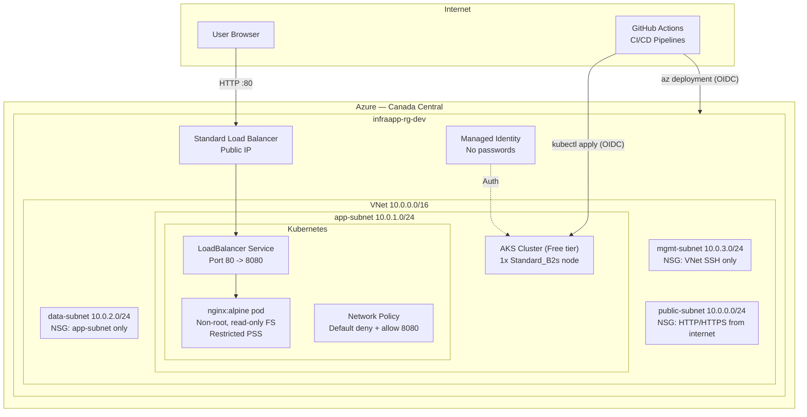

```mermaid
graph TB
    subgraph Internet
        User["User Browser"]
        GHA["GitHub Actions\nCI/CD Pipelines"]
    end

    subgraph Azure["Azure — Canada Central"]
        subgraph RG["infraapp-rg-dev"]
            subgraph VNet["VNet 10.0.0.0/16"]
                subgraph PublicSubnet["public-subnet 10.0.0.0/24\nNSG: HTTP/HTTPS from internet"]
                end
                subgraph AppSubnet["app-subnet 10.0.1.0/24\nNSG: public-subnet + LB + HTTP"]
                    AKS["AKS Cluster (Free tier)\n1x Standard_B2s node"]
                    subgraph K8s["Kubernetes"]
                        Pod["nginx:alpine pod\nNon-root, read-only FS\nRestricted PSS"]
                        SVC["LoadBalancer Service\nPort 80 -> 8080"]
                        NP["Network Policy\nDefault deny + allow 8080"]
                    end
                end
                subgraph DataSubnet["data-subnet 10.0.2.0/24\nNSG: app-subnet only"]
                end
                subgraph MgmtSubnet["mgmt-subnet 10.0.3.0/24\nNSG: VNet SSH only"]
                end
            end
            LB["Standard Load Balancer\nPublic IP"]
            MI["Managed Identity\nNo passwords"]
        end
    end

    User -->|"HTTP :80"| LB
    LB --> SVC
    SVC --> Pod
    GHA -->|"az deployment (OIDC)"| RG
    GHA -->|"kubectl apply (OIDC)"| AKS
    MI -.->|"Auth"| AKS
```
